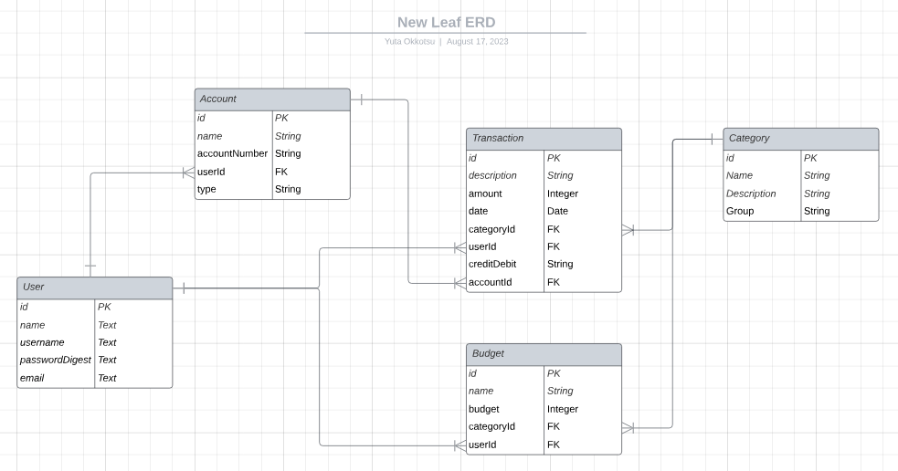

# React-FinancialApp-BackEnd

## Date 08/17/23

### By: [Darran Moore](https://www.linkedin.com/in/darranmoore/), [Dustin Greyfield](https://www.linkedin.com/in/dustinjs/), [Fredy Laksmono](https://www.linkedin.com/in/fredy-laksmono/), [Sierra Coleman](https://www.linkedin.com/in/slaurencoleman/), [Vilem McKael](https://www.linkedin.com/in/vilem-mckael/), [Yuta Okkotsu](https://www.linkedin.com/in/yutaokkotsu/)

####  [Github Dustin](https://github.com/Scynes) | [Github Fredy](https://github.com/fredy-laksmono) | [Github Vilem](https://github.com/Vilem-McKael) | [Github Yuta](https://github.com/yutaokkots)

---

[App-TBA] | [Front-end GitHub](https://github.com/The-Third-Team/React-Vite-FinancialApp) | [Back-end GitHub](https://github.com/The-Third-Team/React-FinancialApp-BackEnd)

---

### Description

***

### Planning
Wireframe   
[link](https://www.figma.com/file/IkxNPJPKZJMMm9tE6xqkc6/2023SummerHackathon.Team3?type=design&node-id=0-1&mode=design&t=ujDekCzwcC20Ad9O-0)    
ERD   

***

### Technologies used
* HTML
* CSS
* Vite
* React
* Typescript
* TailwindCSS
* Flowbite
* PostgreSQL
* Sequelize
* Express
* Node js

***
### Getting Started

#### Frontend Getting Started

#### Backend Getting Started
Pull the repo files to your folder

Run the following command on terminal. (make sure you are in the root folder for the project)

npm install    
npm install -g sequelize-cli (First time only, if you already used sequelize, you may skip this step)

touch .env (First time only if you don't have dotenv setup in your environment or the file got removed)

in the env file, populate with the following, feel free to change the value    
APP_SECRET=examplesupersecretkey    
SALT_ROUNDS=14

sequelize db:create (Only run this one time to create the db)

sequelize db:migrate   
node seed.js   
npm run dev   

Additionally, you can add the following command to clean up from PSQL and reset the ID to 1 (Change the categories to other table name as needed)
ALTER SEQUENCE categories_id_seq RESTART;

***

### Credits

PostgreSQL: [https://www.postgresql.org]   
Sequelize: [https://sequelize.org/]  
Express: [https://expressjs.com/]   
Vite: [https://vitejs.dev/]   
React:[https://reactjs.org/]   
NodeJs: [https://nodejs.org/en/]   
Flowbite React: [https://www.flowbite-react.com/]
Tailwindcss: [https://tailwindcss.com/]
